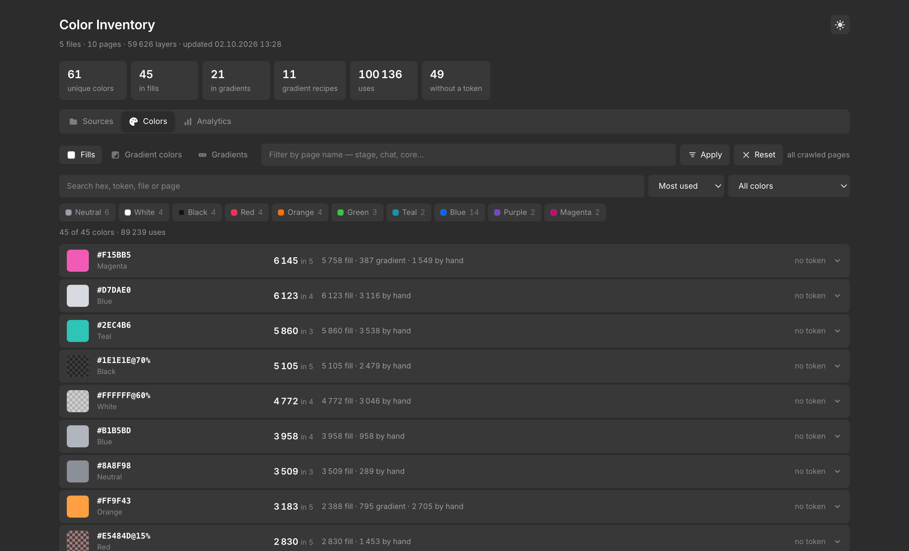
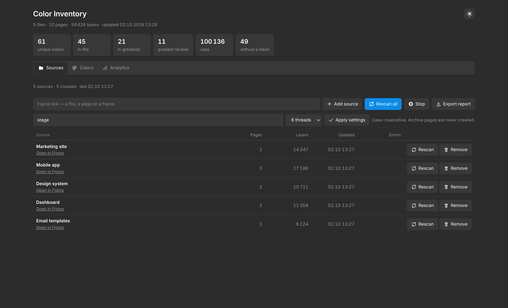
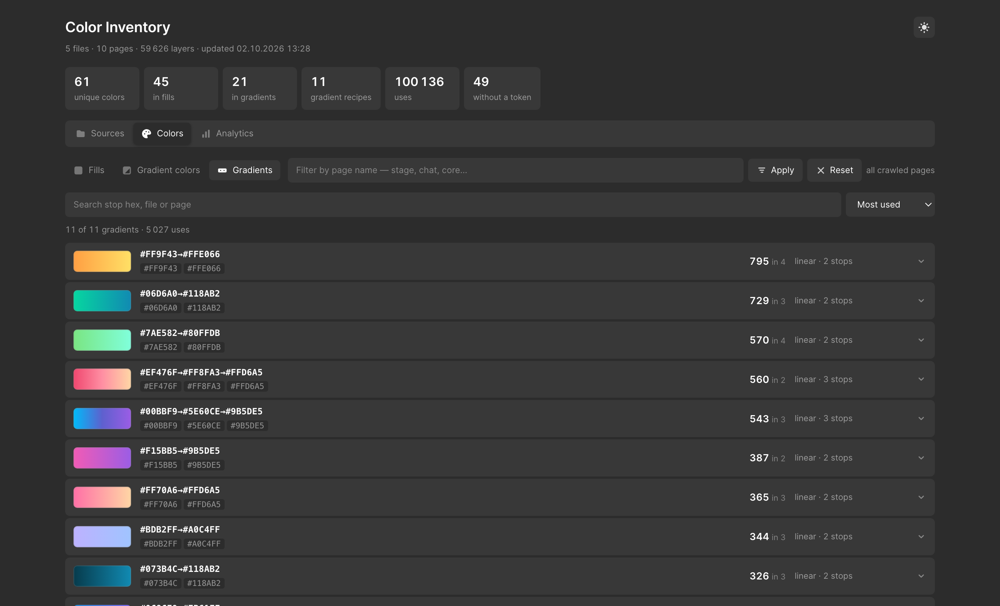
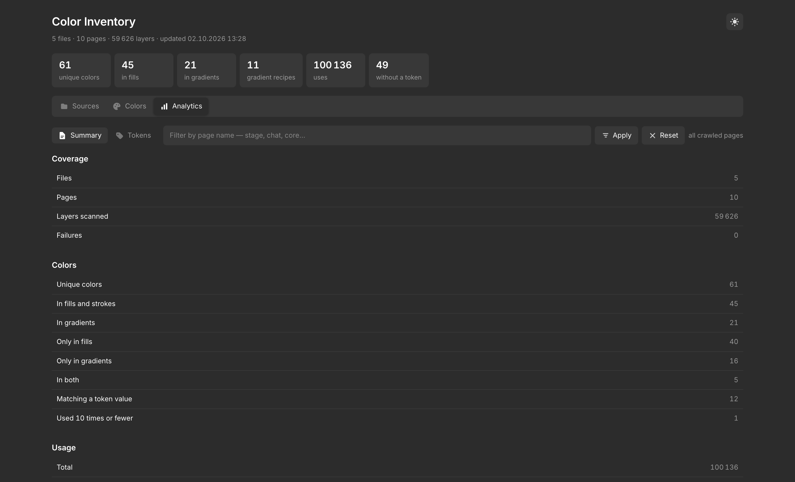
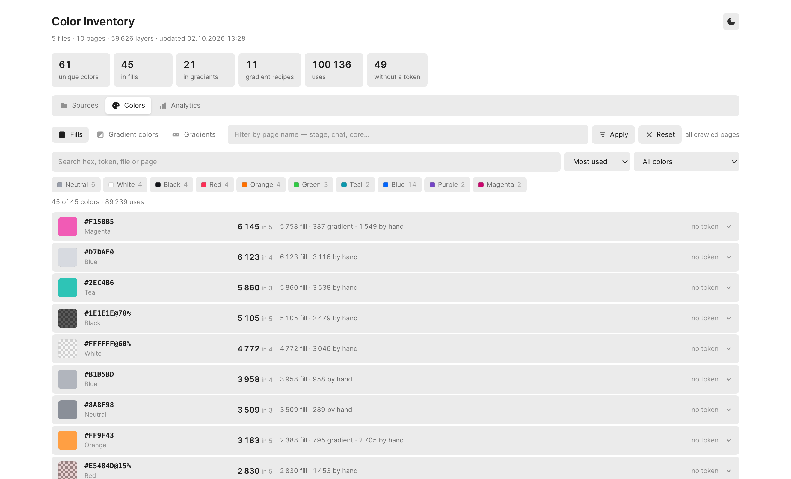

# Color Inventory

Finds every colour used across your Figma files, counts how often each one is
applied, and links straight to the layers that use it.

Built for design-system work: it answers *which colours actually exist in the
product*, *how many of them have no token behind them*, and *where to find them*.

[Русская версия](README.ru.md)



*Every colour, how often it is applied, how much of that is set by hand, and
which token carries the same value. Click a row to get links to the layers.*

<details>
<summary>More screenshots</summary>

**Sources** — what gets crawled, and the controls to do it.



**Gradients** — the recipes themselves, with a preview of each.



**Summary** — the whole picture in numbers.



**Light theme** — toggled from the corner and remembered between visits.
Add `?theme=light` to the address to force it.



</details>

> Screenshots use made-up demo data, not a real project.

## What it does

* Walks the layers of any Figma file through the REST API — **read only**, it
  never writes to your designs.
* Collects **solid fills and strokes** and **every gradient stop** as separate
  colours, with real opacity.
* Records whether each application sits on a variable or a style, or was
  **set by hand**.
* Matches colours against your design-system tokens, so unused tokens and
  untokenised colours both become visible.
* Gives you a **deep link per layer** — click and Figma opens with that layer
  selected.

## Install

Requires `python3` and `curl`, both already present on macOS and most Linux
boxes. No packages to install.

```bash
git clone https://github.com/<you>/color-inventory.git
cd color-inventory
cp settings.example.json settings.json
echo "YOUR_FIGMA_TOKEN" > token.txt
python3 app.py
```

## Open it

Two ways, pick either:

* **Double-click `Color Inventory.command`.** A terminal window opens and the
  browser follows. Keep that window open while you work; press `Ctrl+C` in it
  to stop. This is the one to use if you do not live in a terminal.
* **Run `python3 app.py`** from the folder.

Either way the app is at **http://localhost:8800**. It listens on localhost
only — nothing is exposed to your network.

If the browser does not open by itself, paste the address manually. If the port
is taken, change `PORT` at the top of `app.py`.

Create a token in Figma: **Settings → Security → Personal access tokens**.
It is read from the first place that has it:

1. the `FIGMA_TOKEN` environment variable;
2. `token.txt` next to the tool;
3. `~/.config/figma-colors/token`.

`token.txt` is in `.gitignore` — it will not be committed.

## Try it without Figma

```bash
python3 demo/seed.py && python3 app.py
```

That fills `out/` with made-up files, pages and colours so you can click through
the whole app before pointing it at anything real. Delete `out/` to start clean.

## Use

**Sources** — paste a Figma link and press *Add source*. A file link crawls the
file; a page or frame link crawls just that part. Press *Rescan* on a row, or
*Rescan all* for everything. Crawls run in parallel; the thread count is a
setting.

**Pages to crawl** — only pages whose name contains this text are downloaded.
Default `stage`. Leave it empty to crawl every page. Archive pages are never
crawled, whatever you set.

**Filter by page name** — the field under the stat tiles re-slices every tab to
the matching pages. Server-side, over the full data, so the numbers stay exact.

**Colors** / **Gradient colors** — the same colours split by where they are
used. A colour used both ways appears in both tabs.

**Gradients** — the recipes themselves: stops, type, usage, links.

**Tokens** — your kit's colour tokens and whether each one appears in the
designs. Optional: drop a `tokens.json` next to the tool (any plugin that
exports variables as JSON will do). Without it the tab is simply empty.

**Export report** — writes `colors-report.html`, a standalone file that works
with no server and no internet. Send it to anyone.

## How colours are counted

| | |
|---|---|
| **fill** | a solid colour on a layer's fill or stroke, opacity included |
| **gradient** | each stop of a gradient, counted separately |
| **by hand** | applications with no variable and no style behind them |
| **token** | a kit variable carries exactly this value |

A gradient stop keeps **its own** alpha; the layer's opacity is not folded into
it. Otherwise the same gradient at 75% and at 50% would read as two different
sets of colours.

## Storage

```
out/                       crawl results, one file per slice
  KEY@stage.json             a whole file crawled with the "stage" filter
  KEY@all.json               the same file crawled with no filter
  KEY__1-23.json             one page, crawled from an explicit link
raw/                       temporary API responses, cleaned as it goes
settings.json              your settings
sources.json               your list of sources
colors-report.html         the exported report
```

Slices with different filters live side by side and never overwrite each other.
When the data is assembled, each page is taken **once, from the newest slice**.

### What that means in practice

Crawling with one filter does not throw away what another filter collected —
everything you have ever crawled adds up into one picture.

Say you crawl with `stage`, then later crawl the same files with `local`:

| Page filter in the app | Pages | What you see |
|---|---|---|
| *(empty)* | 188 | everything crawled so far — both sets |
| `stage` | 157 | only the working pages |
| `local` | 31 | only the Local components pages |

So **the default view is the union of everything**, which is usually more than
the last crawl collected. Type a filter in the field under the stat tiles to
narrow it back down. Nothing is lost and nothing is double-counted: a page that
exists in two slices is taken once, from the newer one.

## Limits

* Theme-dependent tokens are read as rendered on the page, so the dark value of
  a token will not appear if the design is drawn in the light theme.
* Effect colours (shadows, glows) are not collected — only fills and strokes.
* The layer counter is approximate: when a page is split into chunks, parent
  nodes appear in several responses. Colour counts are unaffected.

## Publishing

Never push from the working folder: it holds the crawl cache, your sources and
your token. Run the included script instead — it builds a clean copy next to the
project and then scans that copy for anything private.

```bash
./publish.sh
```

It copies only source files and docs, then refuses to continue if it finds a
Figma file key, a Figma link, a home path or an access token. If the scan passes
it prints the git commands to run in the clean folder.

What never leaves your machine: `out/`, `raw/`, `token.txt`, `settings.json`,
`sources.json`, `tokens.json` and the exported report.

## Licence

MIT.
