# Figma Stealer

Shows what in your Figma files follows the design system and what does not, and takes you
straight to the layer that needs fixing. Colors, tokens, typography, text, spacing, effects,
images, comments and components, across any number of files. Works with any files and any
design system, runs on your computer, needs nothing but Python.

[Русская версия](README.ru.md)

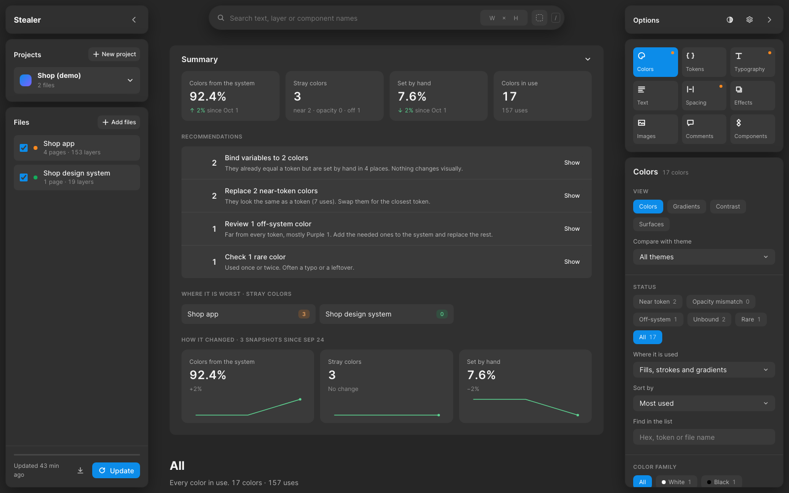

## Try it in a minute

No Figma account needed: the demo builds an invented shop app with typical problems in it and
opens it in the browser.

```bash
python3 -m coloro demo
```

Python 3.9 or newer, the one that ships with macOS is fine. Nothing else to install. The
command is `coloro`: that is the name of the package inside.

## What it shows

Every section starts with its own **summary**: key numbers with changes since the last update,
recommendations in order of impact with a button that shows those places, the files where it is
worst, and a "how it changed" chart. Every number opens the places behind it, with links that
open the layer in Figma.

### Colors

Every color actually in use, split by what to do about it:

- *almost a token*: indistinguishable by eye, swap it for the token;
- *different opacity*: a token's color at another opacity;
- *off the system*: far from every token, add it to the system or replace it;
- *not bound*: a token's value typed by hand, bind it and nothing changes visually.

Color difference is CIEDE2000, the way the eye sees it. Sorting by uses, files, lightness or
family; search by hex, token or file. **Gradients** are listed as recipes: type and stops in order.

**Contrast.** For every layer the tool knows its surface: the fill of the nearest frame or of a
plate under it, with translucent fills mixed as the eye sees them. Text color is checked against
it by WCAG 2.2: fails, AA, AAA. Text on images, gradients or the edge of a plate is marked to
check by eye; outlined text counts its outline.

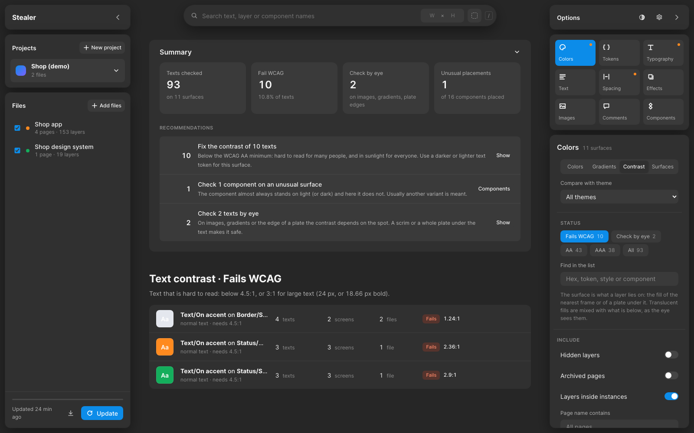

**Surfaces.** Every background in the files; a row opens the list of what is placed on it: text
colors with their contrast, and components.

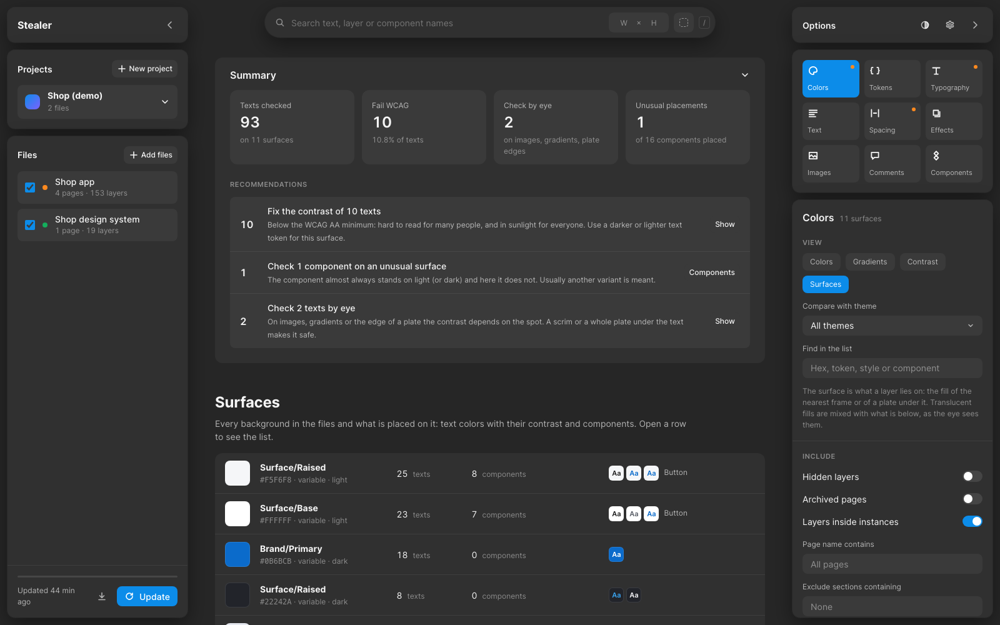

### Tokens

A table like the variables panel in Figma: collections as tabs, groups from the name path, one
column per theme. Bound counts come from the exact variable bindings in the files, matched by the
variable key; "typed by hand" counts the same value set without a variable. Unused tokens and
tokens that change with the theme are marked.

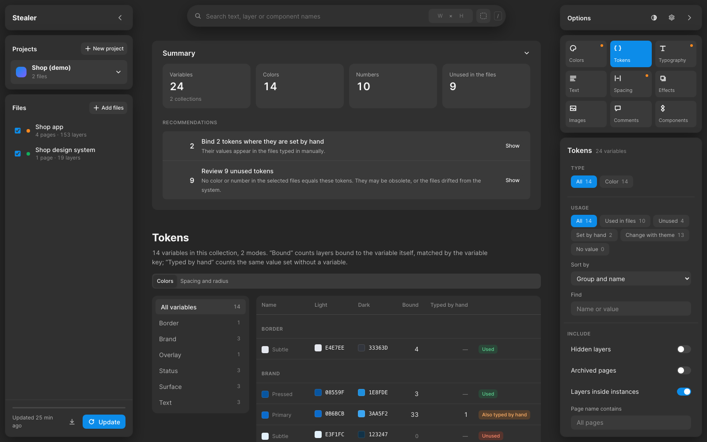

The token library is a file: a Figma variables export, W3C Design Tokens (including the stable
2025.10 format), Tokens Studio or any CSV. Without a library the system is taken from the styles
and variables found in the files.

### Typography and text

**Typography**: texts without a style against the system of styles inferred from the files:
exactly a style (apply it), almost a style (a pixel off), off the system.

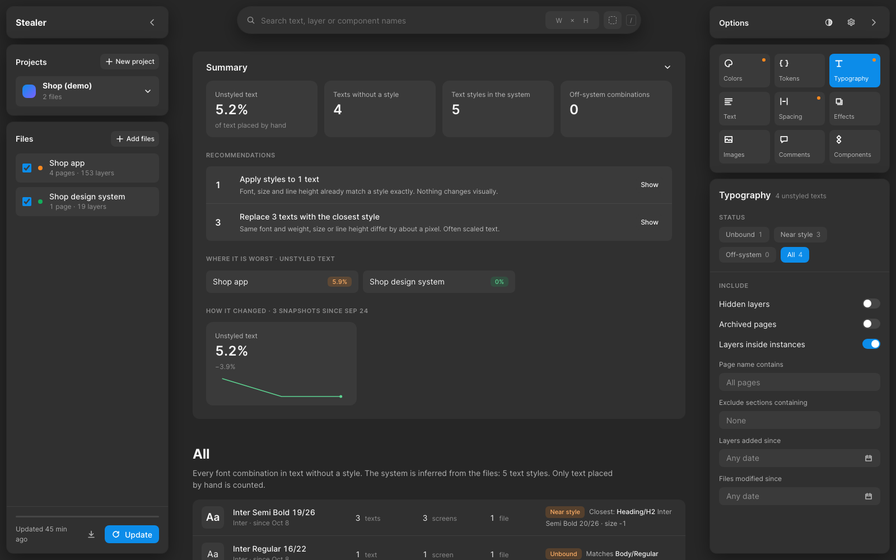

**Text**: every text in the files, the same text in different places as one row: repeated texts,
texts used once, the same words written differently ("Add to cart" and "Add to Cart"), texts
without a style.

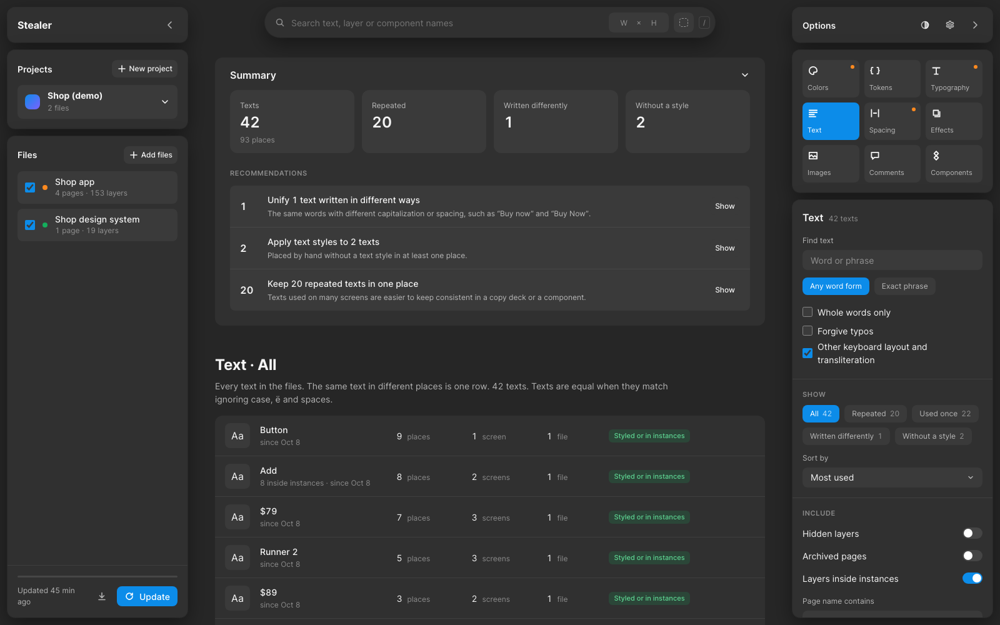

### Spacing, radius, stroke and effects

Numbers against the scale: the scale comes from values bound to variables, or a conventional grid
(spacing in steps of 4) when there are none. Shadows and blurs set by hand against effect styles.

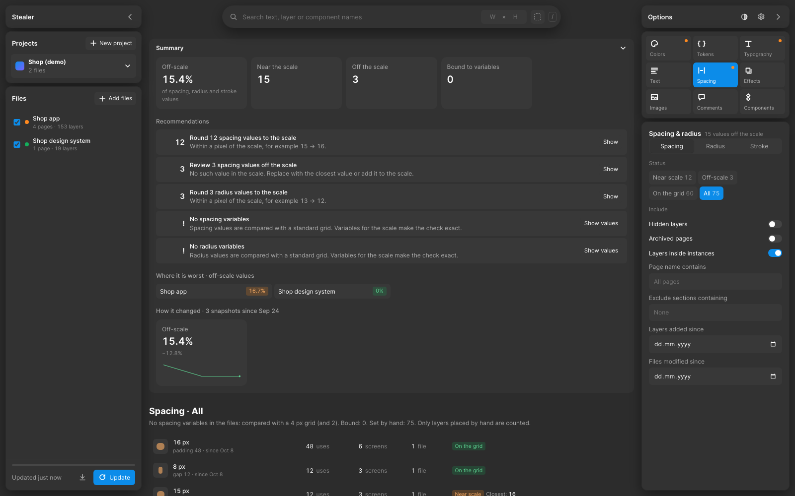

### Images

One row per image across all its places: repeats and leftover placeholders.

### Comments

Discussions in the files with the screen each one is pinned to: open, with no reply yet, open
for more than 30 days, resolved. Sort by date, by silence or by replies, filter by person and
file, group by screen. The summary shows the typical time to resolve.

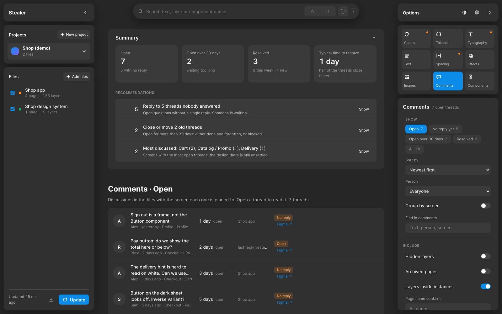

### Components

Where each component is used, which variants, how many instances are overridden, which frames
look like detached copies, and which surfaces each component stands on. A component that almost
always stands on light and in a few places on dark is flagged: another variant is usually meant
there. Optional previews: Figma draws each variant, and the properties (Size, State…) switch like
in Figma, with the layout of the chosen variant for developers.

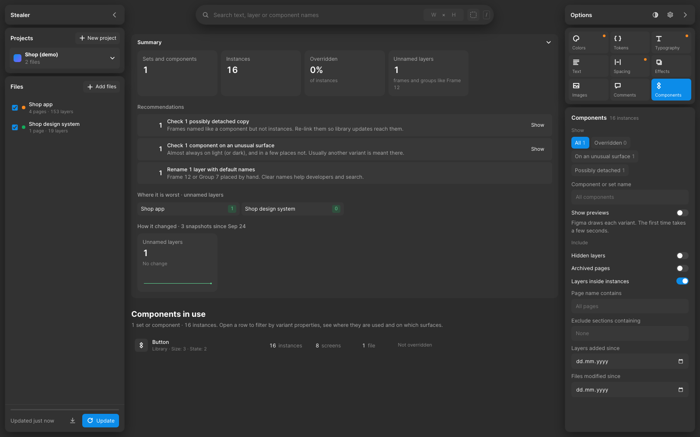

### Search

One bar at the top: text in any word form and order, in text layers, layer and frame names,
component names (then every instance is found) and page or file names. It forgives typos if
asked, and understands a word typed in the other keyboard layout or transliterated, always
checking against words that really are in the files. Width and height with a tolerance; a color
with a picker, eyedropper, opacity and tolerance. The parts combine: "Buy" + 56 × 56 + pink finds
exactly those buttons. Filters over the results: type, component, variant properties, page.

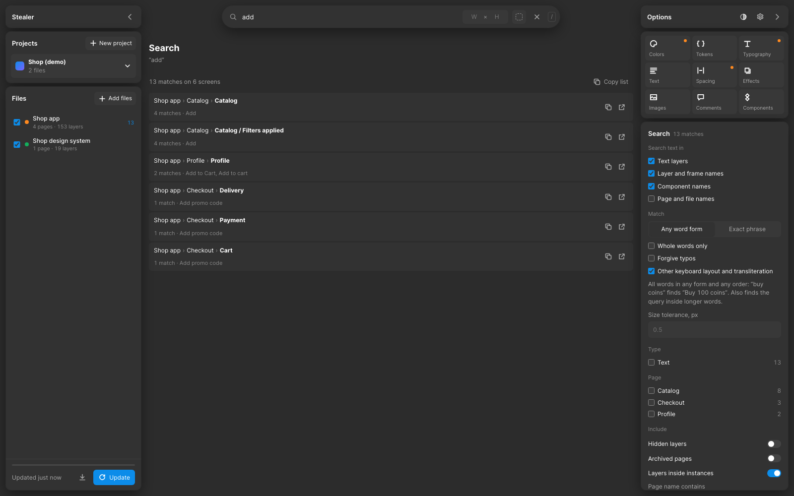

### Report

One HTML file with no external files: send it, attach it, print it.

## Interface

Three floating blocks on each side. On the left: projects (each product has its own files,
token library and history) and files (a checkbox includes a file, a click on its name shows only
that file). On the right: content types, and the options and filters of the chosen type. Each
side collapses into one floating button that keeps showing progress and errors; on a narrow
screen the blocks open as dropdowns. Dark and light themes; English and Russian, switched in the
settings (the gear).

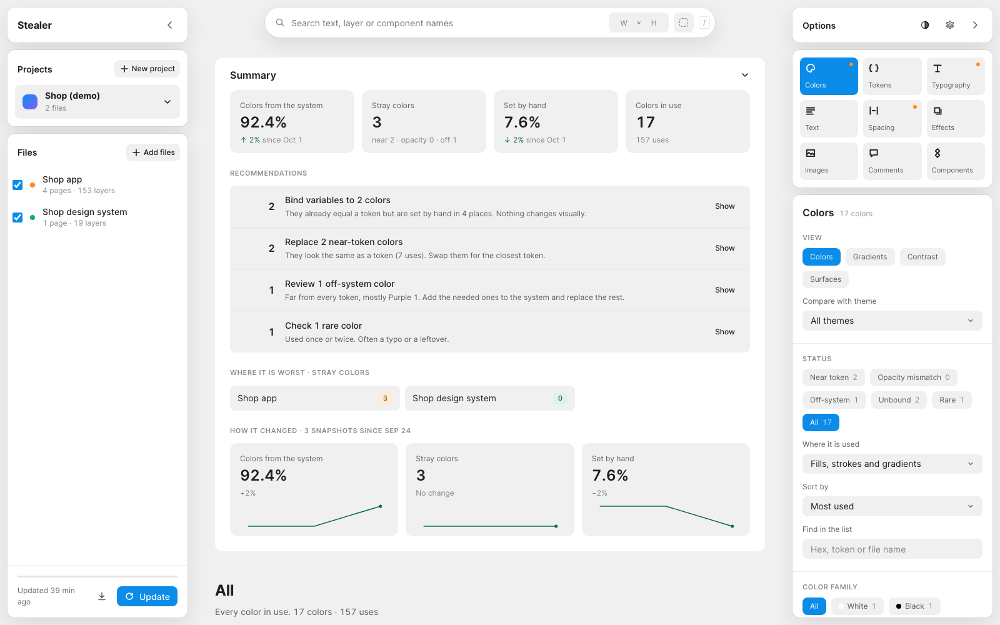

A view can be opened by a link, for example `#/colors?view=contrast` or `#/search?q=checkout`.

## Using it with your files

```bash
python3 -m coloro serve
```

On macOS you can also double-click `Figma Stealer.command`. A browser opens. Then:

1. **Settings (the gear)**: paste a Figma personal access token (Figma → Settings → Security →
   Personal access tokens) with read access to file content and comments. Load the project's
   token library here too, if you have one.
2. **New project** and **Add files** on the left: paste links to Figma files. Pages can be
   limited by words in their names.
3. **Update.** The first load of a big file takes minutes; an update with no changes takes
   seconds, because only the file version is checked and only changed pages are downloaded.
   Comments are refreshed on every update.

The token can also live in `~/.config/coloro/token` or in the `FIGMA_TOKEN` environment
variable. From the terminal:

```bash
python3 -m coloro load "https://www.figma.com/design/…" --pages checkout
```

## Filters

Loading keeps everything (hidden layers, archived pages, utility sections) with labels. Filters
decide what to count when you look, and they are shared by every section, so the numbers always
agree. By default only what is visible on screen is counted:

| Filter | Default |
|---|---|
| Hidden layers | not counted |
| Archived pages (archive in the name) | not counted |
| Layers inside components | counted, they are visible |
| Pages by name | all |
| Sections by name | none excluded |
| Date a layer appeared | all time |

Texts without a style, spacing, effects and unnamed frames are counted only for what was placed
on the screen by hand: inside a component the library sets them.

## Where the data lives

Everything stays on your computer in one file, `~/.coloro/coloro.sqlite` (the demo uses
`~/.coloro/demo.sqlite`). Nothing is sent anywhere except requests to Figma. The server listens on
`127.0.0.1` only and refuses requests from other pages. The token is stored readable by you only
and is never sent back to the interface. Removing a file removes its data; to remove everything,
delete the database file.

## Scale

Tested on 32 working files at once, 4.3 million layers:

| | |
|---|---|
| Loading all of them | 20 minutes, no failures |
| Updating with no changes | 8 seconds |
| Overall picture | 4 s the first time, instant afterwards |
| Colors | 1 s |
| Text and size search | 0.6 s |

## Development

```bash
python3 -m unittest discover -s tests
```

The screenshots are taken from the demo project. The plan and the decisions behind it:
[docs/PLAN.ru.md](docs/PLAN.ru.md) (in Russian).

## License

MIT, see [LICENSE](LICENSE).
