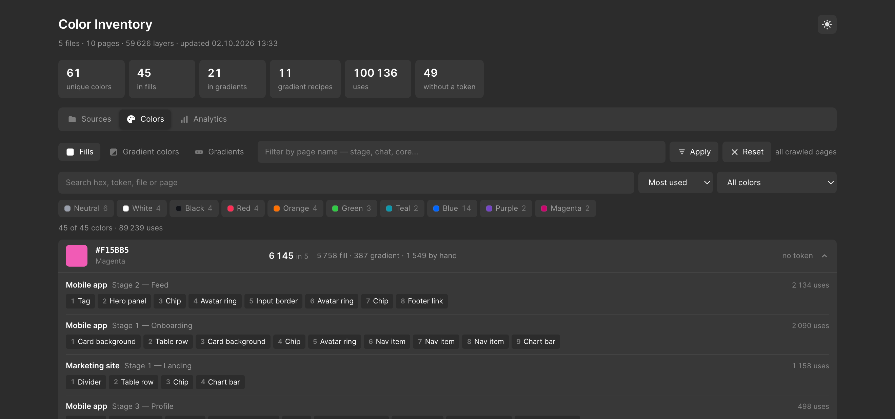
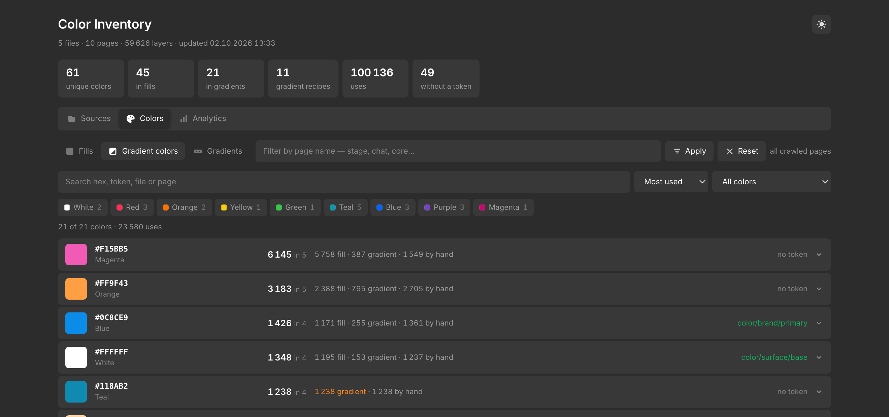
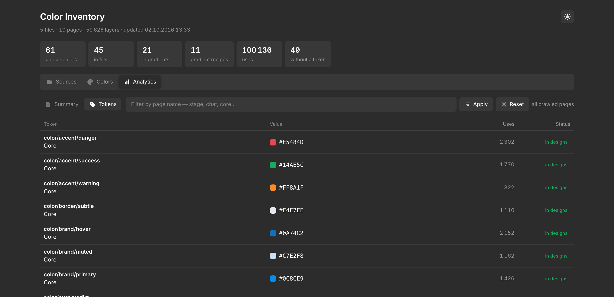

# Color Inventory

Находит все цвета, которые реально используются в макетах Figma, считает, сколько
раз применён каждый, и даёт ссылки прямо на слои.

Сделан для работы с дизайн-системой: отвечает на вопросы «какие цвета вообще есть
в продукте», «сколько из них без токена» и «где их найти».

[English version](README.md)

## Как это выглядит

**Colors** — все цвета, которые реально используются, по убыванию частоты. В строке
видно, сколько пришлось на заливки, сколько на стопы градиентов, сколько набрано
руками без переменной и стиля, и какой токен кита несёт то же значение.


**Где именно лежит цвет** — клик по строке раскрывает файлы и страницы, где он
встречается, со ссылкой на каждый слой. Клик по ссылке открывает Figma с выделенным
слоем.



**Gradient colors** — цвета, встречающиеся как стопы градиентов. Цвет, используемый
и так и так, есть и здесь, и в Colors — в подписи это сказано.



**Gradients** — сами рецепты: стопы, вид, сколько раз применён и в скольких файлах.


**Tokens** — токены кита против реальности: какие встречаются в макетах, какие не
встречаются ни разу, сколько раз применено каждое значение.



**Summary** — вся картина в цифрах, включая объём цвета, набранного руками.


**Sources** — что обходим. Добавить ссылку, обновить один источник или все, выбрать
число потоков, выгрузить отчёт для пересылки.


**Светлая тема** — переключается кнопкой в углу, выбор запоминается. Чтобы задать
принудительно, добавь к адресу `?theme=light`.


> На снимках выдуманные демо-данные, не реальный проект. Команда
> `python3 demo/seed.py` даст такие же у тебя локально.

## Как запустить

Два способа, любой:

* **Двойной клик по `Color Inventory.command`.** Откроется окно терминала, браузер
  поднимется сам. Окно держи открытым, пока работаешь; закрыть — `Ctrl+C` в нём.
* **`python3 app.py`** из папки инструмента.

В обоих случаях приложение живёт по адресу **http://localhost:8800**. Слушает только
localhost — наружу ничего не торчит.

Если браузер не открылся сам — вставь адрес руками. Если порт занят — поменяй `PORT`
в начале `app.py`.

### Что нужно

* `python3` и `curl` — уже есть в macOS, ставить ничего не надо;
* личный токен Figma. Ищется по очереди:
  1. переменная окружения `FIGMA_TOKEN`;
  2. файл `token.txt` рядом с инструментом;
  3. `~/.config/figma-colors/token`.

  Создать: Figma → Settings → Security → Personal access tokens.
  `token.txt` лежит в `.gitignore` — в репозиторий не уедет.

## Пощупать без Figma

```bash
python3 demo/seed.py && python3 app.py
```

Заполнит `out/` выдуманными файлами, страницами и цветами — можно походить по всему
приложению, не подключая ничего настоящего. Чтобы начать с чистого листа, удали `out/`.

## Вкладки

Идут по ходу работы: подключил источники → увидел итог → разобрал по частям →
сверился с китом.

**Sources** — что обходим. Вставляешь ссылку и жмёшь *Add source*. Ссылка на файл
обходит файл, ссылка на страницу или фрейм — только их. *Rescan* у строки обновляет
один источник, *Rescan all* — все. Обход идёт в несколько потоков, число настраивается.

**Summary** — все цифры разом: сколько файлов и страниц, сколько цветов, сколько
применений набрано руками, сколько токенов кита не встречается ни разу.

**Colors** — цвета сплошных заливок и обводок.

**Gradient colors** — цвета, встречающиеся как стопы градиентов. Цвет, который
используется и так и так, есть в обеих вкладках — в подписи это видно.

**Gradients** — сами градиенты: из каких стопов собраны, какого вида, где применяются.

**Tokens** — цветовые токены кита и встречается ли каждый в макетах. Необязательно:
положи рядом `tokens.json` (выгрузку переменных любым плагином) — вкладка оживёт.
Без него она пустая, остальное работает.

**Export report** — собирает `colors-report.html`: самодостаточный файл, работает без
сервера и без интернета, можно переслать кому угодно.

## Какие страницы обходить

Поле на вкладке Sources. Скачиваются только страницы, в имени которых есть эта строка.
По умолчанию `stage`. Очистишь — будут обходиться все страницы. **Архивные не берутся
никогда**, что бы там ни стояло. Регистр не важен.

## Срез по страницам

Поле под плитками. Пишешь часть имени страницы — и вся статистика на всех вкладках
пересчитывается только по ним. Считается на сервере по полным данным, поэтому цифры
точные.

### Как складываются срезы

Обход с одним фильтром **не выбрасывает** то, что собрано другим. Всё, что ты когда-либо
обходил, складывается в одну картину.

Допустим, сначала обошёл с фильтром `stage`, потом те же файлы с фильтром `local`:

| Что в поле среза | Страниц | Что видно |
|---|---|---|
| *(пусто)* | 188 | всё собранное — оба набора сразу |
| `stage` | 157 | только рабочие страницы |
| `local` | 31 | только Local components |

То есть **по умолчанию показывается объединение всего**, и это обычно больше, чем собрал
последний обход. Чтобы вернуться к привычным цифрам — впиши фильтр в поле среза. Ничего
не теряется и не считается дважды: страница, попавшая в два среза, берётся один раз, из
более свежего.

## Как считаются цвета

| | |
|---|---|
| **fill** | сплошной цвет в заливке или обводке слоя, с прозрачностью из пипетки |
| **gradient** | каждый стоп градиента считается отдельно |
| **by hand** | применения, за которыми не стоит ни переменная, ни стиль |
| **token** | в ките есть переменная ровно с таким значением |

У стопа градиента берётся **его собственная** прозрачность — прозрачность слоя в неё не
складывается. Иначе один и тот же градиент на 75% и на 50% читался бы как два разных
набора цветов.

## Ссылки на слои

До 10 страниц на цвет и до 20 слоёв на страницу. Клик открывает файл и выделяет слой.

Слой внутри инстанса имеет составной id, по которому Figma открывается ненадёжно,
поэтому для таких ссылка ведёт на сам инстанс и помечена значком `↗`. Одинаковые ссылки
схлопываются.

## Где что лежит

```
out/                       результаты обхода, по файлу на срез
  КЛЮЧ@stage.json            весь файл, фильтр «stage»
  КЛЮЧ@all.json              тот же файл без фильтра
  КЛЮЧ__1-23.json            одна страница по явной ссылке
raw/                       временные ответы, чистятся на ходу
settings.json              настройки
sources.json               список источников
colors-report.html         выгруженный отчёт
```

## Чего инструмент не видит

* Тёмные значения темозависимых токенов: цвет читается таким, как отрисован в текущей
  теме страницы.
* Цвета теней и свечений — разбираются только заливки и обводки.
* Счётчик слоёв приблизителен: при разбиении страницы на куски родительские узлы
  попадают в несколько ответов. На подсчёт цветов это не влияет.

## Устройство

Подробно о том, как всё работает внутри — в [ARCHITECTURE.ru.md](ARCHITECTURE.ru.md).

## Выкладка на GitHub

Из рабочей папки пушить нельзя: в ней лежит кэш обхода, список твоих файлов и токен.
Для публикации есть скрипт — он собирает чистую копию рядом с проектом и **проверяет
саму копию** на всё приватное.

```bash
./publish.sh
```

Копируются только исходники и документация. Потом копия проверяется на ключи файлов
Figma, ссылки на Figma, домашние пути и токены доступа — если что-то нашлось,
публикация останавливается и показывает, где именно. Если чисто, скрипт печатает
команды git, которые надо выполнить уже в чистой папке.

Никогда не покидают твою машину: `out/`, `raw/`, `token.txt`, `settings.json`,
`sources.json`, `tokens.json` и выгруженный отчёт.

## Лицензия

MIT.
